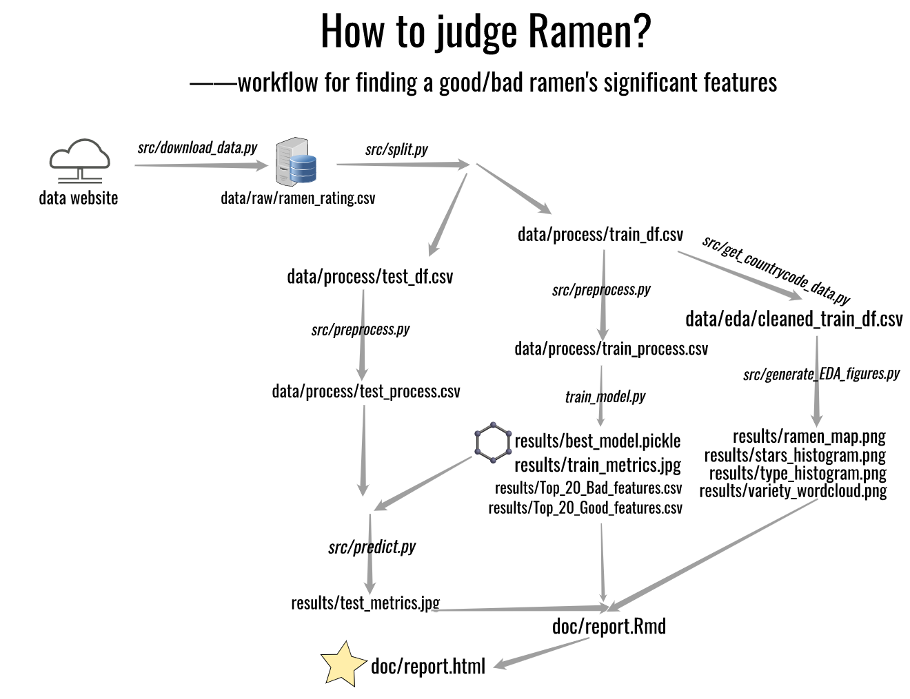

# Ramen Star Prediction

**Contributors:**

This is a project for MDS 522 Group6.

  - Allyson Stoll
  - Irene Yan
  - Wenjia Zhu
  - Xiaohan Chen

## Summary
### Introduction
  How can we know an instant noodle, aka Ramen, tastes good or not? Will the brand matter? Does a cup noodle always taste better than a pack one?

  To figure out what features are important for a Ramen's taste, and predict whether a Ramen is good or not with its features, we used a dataset with over 3000 reviews on all kinds of instant noodles. And since the Star, our target value, is discontinuous. We then define this problem as a categorical problem, and convert the target Star to a binary variable at a threshold of 3.5, with 0 (Star < 3.5) being bad ramen and 1 (Star >= 3.5) for good ramen. This threshold is set by the original reviewer himself.

  This is not a big question, but it is a good start of figuring out a result in real-life problems with data science for us. Considering the usefulness of this model for food lovers around the world when choosing a Ramen, we consider this question a very interesting and meaningful one.

  In this project, we explored the world of instant noodles, aka ramen with a dataset containing over 2500 reviews on all kinds of instant noodles. The main problem we try to solve is to find what features are important for predicting a ramen’s rating. We used the OneHotEncoder(), CountVector() to transform the data. With the logistic regression model, we finally get an AUC score of 0.722 on the test dataset and summarize the top 5 good features and also top 5 bad features in our report. 
### Dataset
The [dataset](https://www.theramenrater.com/wp-content/uploads/2021/09/The-Big-List-All-reviews-up-to-3950.xlsx) we used in this project is downloaded from an data analysist called Aleksey Bilogur. Reviews are based on personal preferences, not on sales of popularity. It is updated as of September 22nd, 2021. Current as of review #3950, recording the Ramen features including:
 - Review: Record ID, not meaningful for Ramen itself.
 - Brand: The company produces this Ramen
 - Variety: A brief description about Ramen's tasty style like spicy, chicken, etc.
 - Country: Where this Ramen comes from
 - Style: It is a cup noodle, bowl noodle or pack one.
 - Top Ten: Whether this Ramen is listed as Top Ten Ramen worldwide before.
And there is one more column: our target column, star.
### Method
We split our data, with 80% as train df and 20% as test df. After exploring the data with EDA, we decide to drop Top Ten column, since it is very sparse, with many NULLs in it. To better interpret each feature's importance to the final prediction, we use a linear regression model. 

Before model training, column transformation is conducted. We use OneHotEncoder() on Brand, Style, and Country, three categorical columns, and CountVector() on Variety, to split these texts into seperate word, finding which word's appearance will make the Ramen better. 

After training this model with the LogisticRegression() method, a basic linear regression model from python package sklearn, we get a AUC score of 0.722 on the test data, which is good enough for a simple model like ours.

AUC, Area Under receiver operating characteristic Curve. We choose this score metrix to relieve possible problems in the context of class imbalanced, the target classes (good and bad) is 0.7 vs. 0.3.
## Report
The final report can see here: [Report](https://github.com/PANDASANG1231/522_Ramen/blob/main/doc/report.html)

## Usage

We use python in this project and the workflow and orders of using scripts is as below:

### With Docker
You can run the pipeline with:
>To be added
### Without Docker
Use makefile and run the following command from terminal at the root directory of this repo:
>Make all

## Dependencies

The dependencies is listed in the environment.yaml, which you can find [here](https://raw.githubusercontent.com/PANDASANG1231/522_Ramen/main/environment.yaml).

 - ipykernel
  - matplotlib>=3.2.2
  - scikit-learn>=1.0
  - pandas>=1.3.*
  - requests>=2.24.0
  - altair_saver
  - vega_datasets
  - graphviz
  - python-graphviz
  - jinja2y
  - pip
  - py-xgboost==1.3.0
  - catboost
  - spacy
  - wikipedia
  - nltk
  - seaborn
  - imbalanced-learn
  - pandas-profiling
  - ipywidgets
  - docopt
  - pycountry
  - wordcloud
  - geopandas
  - openpyxl
  - pip:
    - mglearn
    - psutil>=5.7.2
    - rpy2

## License

The source code for the site is licensed under the MIT license, which you can find [here](https://raw.githubusercontent.com/PANDASANG1231/522_Ramen/main/LICENSE).

## References

Updated as of September 22nd, 2021. Current as of review #3950.
reviews are based on personal preferences, not on sales of popularity.
Scores are in .25 increments – rounding is NOT recommended. Think of letter
grading; a 3.5 score out of 5 stars – (3.5 * 2) * 10 = 70 = C.
 <https://www.theramenrater.com/resources-2/the-list/>.

Ramen (ラーメン) is a noodle soup dish that was originally imported from China
 and has become one of the most popular dishes in Japan in recent decades.
Ramen are inexpensive and widely available, two factors that also make them 
an ideal option for budget travelers. Ramen restaurants, or ramen-ya, can 
be found in virtually every corner of the country and produce countless regional 
variations of this common noodle dish.
<https://www.japan-guide.com/e/e2042.html>.

