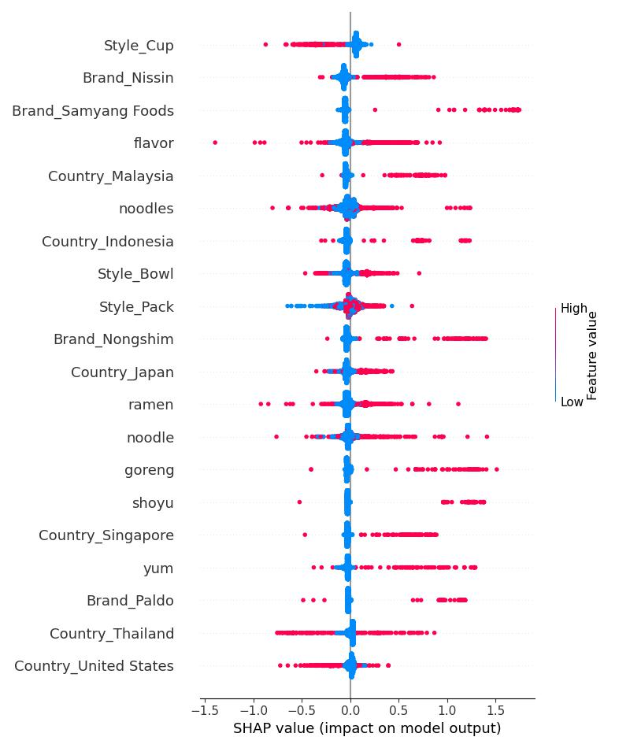

```{r setup, include=FALSE}
knitr::opts_chunk$set(echo = FALSE)
library(knitr)
#library(kableExtra)
library(tidyverse)
```


# Introduction

In this project, we explored the world of instant noodles, aka ramen. Our data set is from the Ramen Rater website created by a single ramen enthusiast, with over 2500 reviews on all kinds of instant noodles one can possibly find in stores [@rr]. 

The main problem we try to solve is to find what features are important for predicting whether a given ramen is good or not. We used the OneHotEncoder(), CountVector() to transform the data and a CatBoost model.

This is not a big question, but it is a good start of figuring out a result in real-life problems with data science for us. Considering the usefulness of this model for food lovers around the world when choosing nearby ramen restaurants, we think this is a very interesting and meaningful question.

# The Dataset

Each observation in the data set is a review for a single ramen product. The features include a review number, where bigger number represents a more recent review, the brand, the product's name, its manufacturing country, packing style (such as cup or bowl), and star ratings, which range from 0 to 5 inclusively with 0.25 increments. Note that the stars represent the reviewer's personal taste and are a very subjective scoring.

# Exploratory Data Analysis

To understand the data better, we explore to visualize the distribution of the country of origins of all products. It seems that most products come from China, South Korea, Japan, and the USA.

```{r country-distributions, echo=FALSE, fig.cap="Figure 1. Origins of Ramen Products", out.width = '100%'}

```

There are many variety and the below word cloud displays the most common keywords in ramen descriptions. Wow, these noodles are created with so many flavors! They also come in with different packaging. A half of the sample come in as a pack. But some are sold in a bowl or tray, which are more convenient for direct usage.

```{r variety-distributions, echo=FALSE, fig.cap="Figure 2. Word Cloud of Ramen Variety and Package Style Histogram", out.width = '50%', out.height = '25%', fig.show='hold', fig.align='center'}
knitr::include_graphics(c("../results/figures/variety_wordcloud.png",
                          "../results/figures/type_histogram.png"))
```

Let's see how the ratings distribute. It look like most ramens are quite tasty! But there are a few that received a zero star.

```{r rating-distributions, echo=FALSE, fig.cap="Figure 3. Histogram of Ratings", out.width = '50%', out.height = '35%', fig.align='center'}

```

# Methods

For the preprocessing, we apply One Hot Encoding to transform  `brand`, `country`, and `style` and use bag-of-word to process `variety` feature. We drop `top ten` and `review #`. We also convert the target `Star` rating to a binary variable at a threshold of 3.5, with 0 (`Star` < 3.5) being bad ramen and 1 (`Star` >= 3.5) for good ramen. This threshold is set by the original reviewer himself. 

While doing model selection, we tried 4 types of model, which are CatBoost, Logistic Regression, Random Forest, and SVM. While doing feature selection, we used one wrapper algorithms (boruta algorithm) and recursive feature elimination. We finally chose `CatBoost` and `Boruta Algorithm` selected features as our final model's setup. As the plot below, this model has the high valid accuracy (0.758) and a small accuracy gap (0.046) between valid dataset and train dataset with only 77 features.

```{r model_feature_selection, echo=FALSE, fig.cap="Figure 4. Test accuracy and Train/Test accuracy gap of different combinations", out.width = '100%'}
knitr::include_graphics("../results/feature_model_selection.jpg")
```

Five-fold cross validation and random search are used to optimize the model. After searching hyperparameters, we use {'learning_rate': 0.078, 'max_depth': 5, 'n_estimators': 600} as our final parameters. Since the class distribution for the two classes is 0.7 vs. 0.3, so we decide to train the model with parameter class_weights equals to balanced.


# Results

On the test data, the CatBoost model gives a precision score of 0.760, a recall score of 0.954, and a F1 score of 0.847. It is good enough for a simple model like ours. 

As below, these two tables shows us the valid and test's performance.

```{r valid_performance, echo=FALSE}
valid <- read.csv("../results/cross_valid_metric.csv")
kable(valid,
      caption = "Table 1. Validation and Train Performance") 
```

```{r test_performance, echo=FALSE}
test <- read.csv("../results/test_metric.csv")
kable(test,
      caption = "Table 2. Test and Train Performance") 
```

As below, the plot shows us the confusion matrix of the CatBoost.

```{r confusion_matrix, echo=FALSE, out.width = '50%'}
knitr::include_graphics("../results/confusion_matrix.jpg")
```

# Interpetation

Shapley value are used here to explain the CatBoost as below. We can see that there are more good ramens associated features than those of bad ramens. It makes sense because the dataset tends to score positively to ramens. Good ramen noodles are usually associated with features like being brand Samyang Foods or Nissin, having description keyword "goreng" (which refers to fried food in Southeast Asian cuisine [@goreng]), and are made in Japan or Indonesia. On the other hand, bad ramen noodles are associated with features like being cup noodle or made in United States. Now whenever you are craving for quick, simple, and tasty ramen noodles, remember to come back for this plot!

```{r shap_explainer, echo=FALSE, out.width = '50%'}

```


# Critique

First of all, the amount of data used to build the model is relatively small, which may have a certain impact on the model performance. Secondly, the feature `Top ten` was not used in the analysis process. In the future, we hope to make reasonable use of this indicator after learning more data processing methods. Lastly, we recognize that the data set contains reviews done by a single person, which makes our prediction model very subjective and not generalizable for the general audience. One shall proceed with caution when using this result as a shopping guide.

# References
@knitr

@docopt