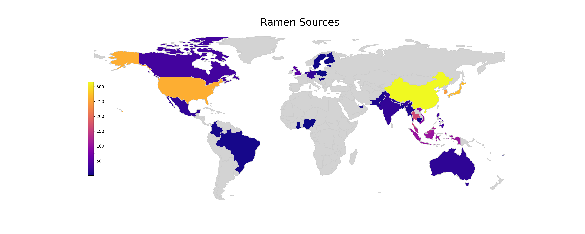
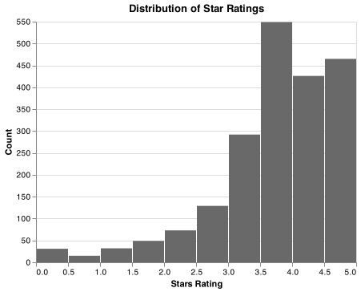

```{r setup, include=FALSE}
knitr::opts_chunk$set(echo = FALSE)
library(knitr)
library(kableExtra)
library(tidyverse)
```


# Introduction

In this project, we explored the world of instant noodles, aka ramen. Our data set is from the Ramen Rater website created by a single ramen enthusiast, with over 2500 reviews on all kinds of instant noodles one can possibly find in stores. We are interested in what features are important for predicting a ramen's rating.

# The Dataset

Each observation in the data set is a review for a single ramen product. The features include a review number, where bigger number represents a more recent review, the brand, the product's name, its manufacturing country, packing style (such as cup or bowl), and star ratings, which range from 0 to 5 inclusively with 0.25 increments. Note that the stars represent the reviewer's personal taste and are a very subjective scoring.

# Exploratory Data Analysis

To understand the data better, we explore to visualize the distribution of the country of origins of all products. It seems that most products come from China, South Korea, Japan, and the USA.

```{r country-distributions, echo=FALSE, fig.cap="Figure 1. Origins of Ramen Products", out.width = '100%'}

```

There are many variety and the below word cloud displays the most common keywords in ramen descriptions. Wow, these noodles are created with so many flavors! They also come in with different packaging. A half of the sample come in as a pack. But some are sold in a bowl or tray, which are more convenient for direct usage.

```{r variety-distributions, echo=FALSE, fig.cap="Figure 2. Word Cloud of Ramen Variety and Package Style Histogram", out.width = '50%', out.height = '25%', fig.show='hold', fig.align='center'}
knitr::include_graphics(c("../results/variety_wordcloud.png",
                          "../results/type_histogram.png"))
```

Let's see how the ratings distribute. It look like most ramens are quite tasty! But there are a few that received a zero star.

```{r rating-distributions, echo=FALSE, fig.cap="Figure 3. Histogram of Ratings", out.width = '50%', out.height = '35%'}

```

# Methods

# Results


interprets the findings

# Critique


# References
